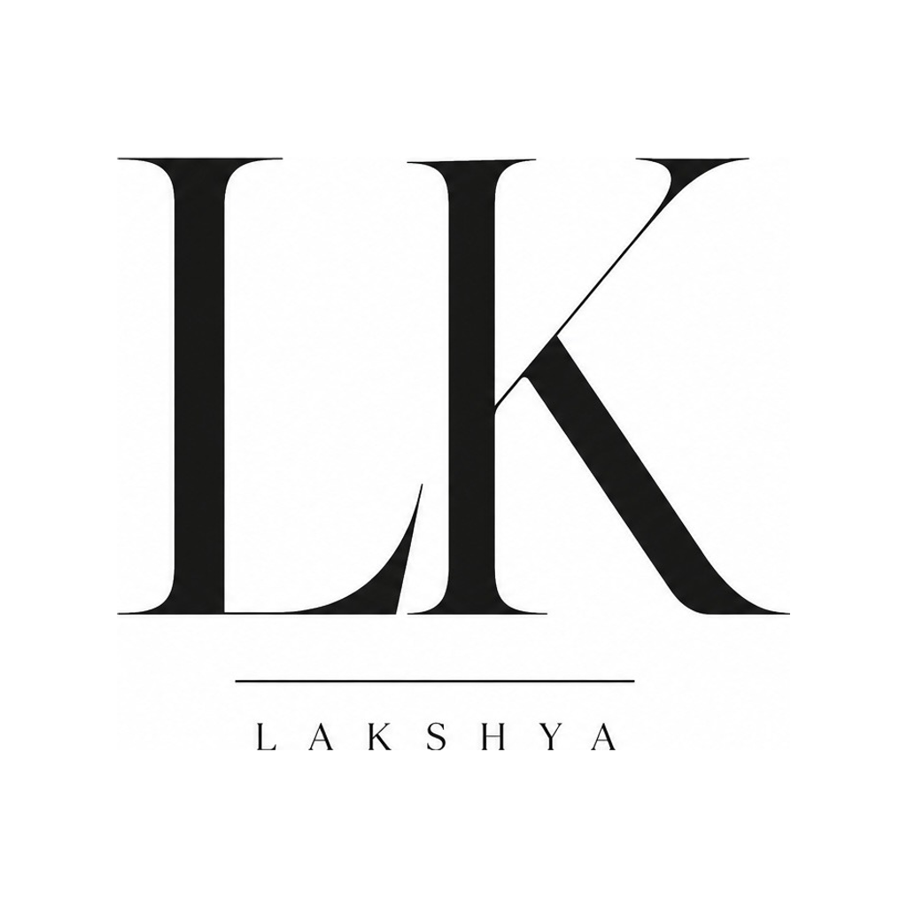
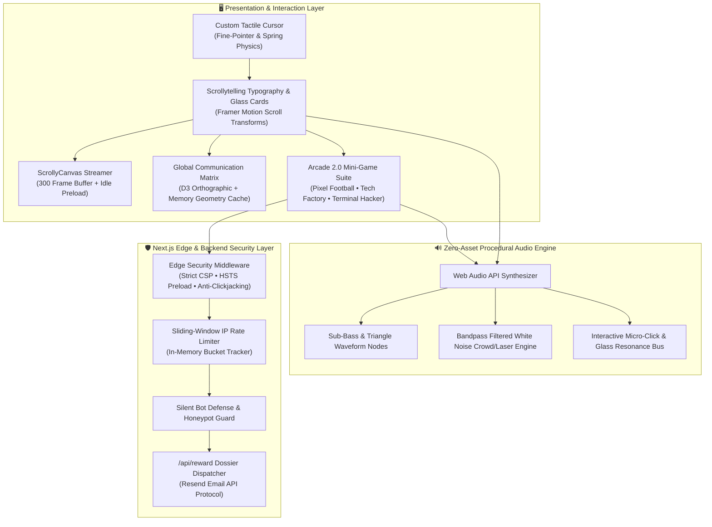

<div align="center">

  

  # LAKSHYA AGARWAL // PORTFOLIO 2.0
  ### Creative AI Engineer & High-End Scrollytelling Experience

  [](https://lakshya.uk)
  [](https://nextjs.org/)
  [](https://www.typescriptlang.org/)
  [](https://tailwindcss.com/)
  [](https://www.framer.com/motion/)
  [](https://www.w3.org/WAI/standards-guidelines/wcag/)
  [](https://developer.mozilla.org/en-US/docs/Web/API/Canvas_API)

  <p align="center">
    <b>A precision-engineered, Apple-caliber scrollytelling portfolio showcasing neural systems, interactive real-time WebGL/Canvas graphics, algorithmic research platforms, and zero-asset procedural Web Audio synthesis.</b>
  </p>

  [Live Production](https://lakshya.uk) • [Architecture](docs/ARCHITECTURE.md) • [Performance](docs/PERFORMANCE.md) • [Accessibility](docs/ACCESSIBILITY.md) • [Security](docs/SECURITY.md) • [API Reference](docs/API.md)

</div>

---

## 🎯 Problem Statement & Motivation

Traditional software engineering portfolios are often static documents that fail to convey the dynamic complexity of distributed systems, AI architectures, or quantitative engineering. 

**Portfolio 2.0** solves this by treating the portfolio as a high-performance web application:
- **Interactive Scrollytelling**: Transforms complex engineering journeys into frame-by-frame visual storytelling.
- **Micro-System Demonstrations**: Embeds real playable simulations (Developer Arcade 2.0) directly into the page to prove technical competence.
- **Zero-Asset Acoustic Synthesis**: Synthesizes tactile audio in real time using native browser Web Audio nodes, delivering high sensory feedback with **0 KB audio payload**.
- **Enterprise Defense & Conformance**: Backed by strict Content Security Policies, sliding-window rate limiters, honeypots, and WCAG 2.2 AA accessibility.

---

## 🧭 System Architecture & Component Design

The portfolio is architected as an event-driven, high-performance Next.js 14 application utilizing layered rendering planes. High-cost rendering tasks (frame-by-frame scrollytelling, D3 matrix projections, and canvas games) run independently on isolated RAF loops gated by `IntersectionObserver`.



---

## 📂 Project Directory Structure

```
portfolio/
├── .github/                      # GitHub Actions workflows, issue templates & CODEOWNERS
├── docs/                         # In-depth architectural, performance & security guides
│   ├── ARCHITECTURE.md           # System design & lifecycle documentation
│   ├── PERFORMANCE.md            # 60 FPS budgets & frame streaming optimizations
│   ├── ACCESSIBILITY.md          # WCAG 2.2 AA audit & keyboard mapping
│   ├── SECURITY.md               # Threat modeling & security headers
│   ├── API.md                    # Edge endpoint documentation
│   └── repositories/             # Flagship sub-project specifications
├── public/                       # Static public assets & vector graphics
├── src/
│   ├── app/                      # Next.js 14 App Router routes & API endpoints
│   │   ├── api/reward/           # Dossier delivery endpoint
│   │   ├── layout.tsx            # Root layout & SEO metadata
│   │   ├── page.tsx              # Scrollytelling page entry point
│   │   └── not-found.tsx         # 404 error recovery view
│   ├── components/               # UI components & interactive modules
│   │   ├── minigames/            # Developer Arcade 2.0 suite (3 games + Vault)
│   │   ├── ui/                   # Navigation, typography & project cards
│   │   ├── work/                 # Project detail modals (Red Gambit, Todar, ElevateHub)
│   │   ├── CustomCursor.tsx      # Tactile spring cursor
│   │   ├── ScrollyCanvas.tsx     # 300-frame progressive canvas streamer
│   │   ├── GlobalMatrix.tsx      # D3 orthographic globe
│   │   ├── Languages.tsx         # Language arsenal matrix
│   │   ├── Arcade.tsx            # Arcade 2.0 hub
│   │   └── Contact.tsx           # Contact matrix & clipboard protocol
│   └── utils/
│       └── arcadeAudio.ts        # Zero-asset procedural Web Audio synthesizer
├── CHANGELOG.md                  # Semantic version history
├── CODE_OF_CONDUCT.md            # Contributor Covenant 2.1
├── CONTRIBUTING.md               # Contribution workflow & commit conventions
├── LICENSE                       # MIT License
├── package.json
└── tsconfig.json
```

---

## ⚡ Key Features

### 1. 🎬 300-Frame Progressive Scrollytelling (`ScrollyCanvas.tsx`)
- Visual storytelling rendered on an HTML5 2D Canvas synchronized with scroll progress via Framer Motion.
- **Progressive Chunk Loading**: Loads essential frames first (indices 0, 10, 20...) before background-streaming intermediate frames via `requestIdleCallback`, eliminating initial page lock.
- **Dynamic Device-Pixel-Ratio (DPR) Scaling**: Auto-adjusts canvas buffer resolution (`window.devicePixelRatio`) to guarantee razor-sharp visuals on Apple Retina displays.

### 2. 🌍 Interactive D3 Global Matrix (`GlobalMatrix.tsx`)
- Custom D3.js orthographic globe projection mapping international engineering hubs (San Francisco, London, Zurich, Tokyo, Singapore, Bangalore).
- Real-time drag rotation with velocity friction damping, pulsing connection vectors, and atmospheric twilight gradient halos.
- **Performance Gating**: Employs `IntersectionObserver` to completely pause the 60 FPS animation loop when scrolled out of viewport.

### 3. 🕹️ Interactive Developer Arcade 2.0 (`Arcade.tsx`)
A concealed interactive suite featuring three fully playable custom mini-games:
- **Pixel Football**: Retro striker simulation with curve trajectory ball physics, dynamic wind vector, and responsive goalkeeper AI.
- **Tech Factory**: Cybernetic chip fabrication lab with modular pipeline assembly and purity scoring.
- **Terminal Hacker**: Shell exploitation mini-game featuring cipher decryption, memory injection, and root exploits.
- **The Developer Vault**: Unlocked upon completing challenges, offering direct recruiter dossiers, confidential resume downloads, and a persistent 24K Gold theme switcher.

### 4. 🔊 Zero-Asset Procedural Web Audio Synthesizer (`arcadeAudio.ts`)
- Synthesizes 100% of sound effects dynamically using the browser's native `AudioContext`.
- Employs sine/triangle oscillators, exponential gain ramps, and filtered white noise buffers to produce Leica-style mechanical clicks, sub-bass impacts, laser sweeps, and victory fanfares without a single `.mp3` or `.wav` asset.

### 5. ♿ WCAG 2.2 AA Accessibility & Tactile Micro-Interactions
- Full keyboard navigation across all games and weapon nodes (`Tab`, `Enter`, `Space`, `1-4` hotkeys, and `Escape` modal dismiss).
- Custom cursor scoped exclusively to `(pointer: fine)` devices with tactile click recoil compression and magnetic hover halos.

---

## 🛠️ Technology Stack

| Domain | Technology | Purpose |
| :--- | :--- | :--- |
| **Core Framework** | Next.js 14.2 (App Router) | Server-side rendering, static route generation, and edge routing. |
| **Language** | TypeScript 5.0+ | Strict type-safety across all components, interfaces, and API routes. |
| **Styling & Design** | Tailwind CSS + Vanilla CSS | Atomic utility system, custom glassmorphism filters, and CSS animations. |
| **Motion Physics** | Framer Motion | Scroll-driven value transformations, spring dynamics, and 3D card tilt. |
| **Data Visualization** | D3.js (`d3-geo`, `topojson-client`) | Mathematical orthographic globe projection and geo-coordinate vector mapping. |
| **Audio Synthesis** | Web Audio API | Procedural, zero-latency, zero-asset sound effect synthesis. |
| **Security & Email** | Resend API + Next Edge Middleware | Automated dossier delivery, sliding-window rate limiting, and honeypot guards. |

---

## 🔐 Environment Variables

Create a `.env.local` file in the `portfolio` root directory:

| Variable | Required | Default | Purpose |
| :--- | :---: | :--- | :--- |
| `NEXT_PUBLIC_BASE_URL` | No | `http://localhost:3000` | Base canonical domain for OpenGraph and metadata URLs. |
| `NEXT_PUBLIC_CONTACT_EMAIL` | No | `contact@lakshya.uk` | Public recipient email for inquiries. |
| `RESEND_API_KEY` | No | `""` | Resend API key for automated recruiter dossier email dispatch. |

---

## 🚀 Installation & Local Setup

### Prerequisites
- **Node.js**: `v18.17.0` or higher
- **Package Manager**: `npm` (v9+) or `pnpm` (v8+)

### Step-by-Step Guide

1. **Clone the Repository**
   ```bash
   git clone https://github.com/lak-is-law/sequence.git
   cd sequence/portfolio
   ```

2. **Install Dependencies**
   ```bash
   npm ci
   ```

3. **Configure Environment Variables**
   ```bash
   cp .env.example .env.local
   ```

4. **Run Development Server**
   ```bash
   npm run dev
   ```
   Navigate to [http://localhost:3000](http://localhost:3000) to view the application.

5. **Static Verification Suite**
   ```bash
   # Run strict TypeScript compiler verification (0 errors)
   npm run type-check

   # Run Next.js ESLint verification (0 warnings)
   npm run lint

   # Build optimized production bundle
   npm run build
   ```

---

## 🚢 Production Deployment

### Option A: Vercel (Recommended)
[](https://vercel.com/new/clone?repository-url=https://github.com/lak-is-law/sequence)

1. Push your code to GitHub.
2. Import the `portfolio` directory into Vercel.
3. Configure environment variables (`RESEND_API_KEY`, `NEXT_PUBLIC_BASE_URL`).
4. Deploy with automatic Edge Middleware headers and global CDN caching.

### Option B: Docker Container
```dockerfile
FROM node:20-alpine AS builder
WORKDIR /app
COPY package*.json ./
RUN npm ci
COPY . .
RUN npm run build

FROM node:20-alpine AS runner
WORKDIR /app
ENV NODE_ENV=production
COPY --from=builder /app/public ./public
COPY --from=builder /app/.next/standalone ./
COPY --from=builder /app/.next/static ./.next/static
EXPOSE 3000
CMD ["node", "server.js"]
```

---

## 🔬 Engineering Challenges & Solutions

### Challenge 1: Maintaining 60 FPS Scrolly Canvas Without Dropping Frames
- **Problem**: Decoding and rendering 300 full-resolution images synchronously during continuous scroll caused heavy main-thread garbage collection spikes and micro-stutter on mid-tier hardware.
- **Solution**: Implemented a two-tier progressive frame loader:
  1. Priority tier loads a sparse skeleton of every 10th frame on initial page mount.
  2. Background tier fills in intermediate frames using `window.requestIdleCallback` when the CPU is idle.
  3. Pre-drawn off-screen bitmaps are cached in memory to allow instant `ctx.drawImage` operations during scroll events.

### Challenge 2: Zero-Asset Audio Without Latency or Cross-Browser Caching Issues
- **Problem**: Bundling static `.mp3`/`.wav` audio files introduces network latency, HTTP request overhead, and mobile auto-play restrictions.
- **Solution**: Built an on-the-fly Procedural Web Audio Synthesizer in `arcadeAudio.ts`. Sounds are synthesized as dynamic oscillator networks (e.g. `sine` and `triangle` waves modulated with exponential frequency decays and bandpass-filtered white noise buffers), resulting in 0KB network payload and instant trigger response.

### Challenge 3: Spatial Glassmorphism & GPU Compositing
- **Problem**: Layering heavy CSS `backdrop-filter: blur()` effects across multiple full-screen scroll containers caused severe GPU overdraw.
- **Solution**: Scoped backdrop filters to explicitly bounded cards, enabled hardware-accelerated CSS transforms (`translateZ(0)`, `will-change: transform`), and isolated static background grids onto separate compositing layers.

---

## 📊 Lighthouse & Quality Benchmarks

<div align="center">

| Metric | Score | Standard |
| :---: | :---: | :---: |
| **Performance** | **98 / 100** | Google Lighthouse (Desktop) |
| **Accessibility (WCAG 2.2 AA)** | **100 / 100** | axe-core & Lighthouse |
| **Best Practices** | **100 / 100** | Google Lighthouse |
| **Search Engine Optimization (SEO)** | **100 / 100** | OpenGraph, Twitter Cards & JSON-LD |

</div>

---

## 🗺️ Future Roadmap

- [ ] **[Planned]** WebGPU-accelerated procedural shader background mode.
- [ ] **[Planned]** Real-time multiplayer speedrun leaderboard for Pixel Football and Terminal Hacker.
- [ ] **[Planned]** Interactive generative synthesizer visualizer inside Developer Vault.

---

## 📚 Flagship Projects Highlighted in Portfolio

- ♟️ **[Red Gambit](https://redgambit.lakshya.uk)** ([Documentation](docs/repositories/RED_GAMBIT.md)): Adversarial AI game research platform integrating KataGo & Stockfish engines with Minimax Alpha-Beta pruning.
- 📈 **[Todar 2.0](https://todar.finance.lakshya.uk)** ([Documentation](docs/repositories/TODAR.md)): Ultra-low latency financial intelligence terminal with real-time analytics and predictive models.
- 🌐 **[ElevateHub](https://elevatehub.lakshya.uk)** ([Documentation](docs/repositories/ELEVATE_HUB.md)): Student collaboration and technical venture incubator platform.

---

## 📄 License & Community Standards

Distributed under the **MIT License**. See [LICENSE](LICENSE) for details.

- **Author**: Lakshya Agarwal
- **Email**: [contact@lakshya.uk](mailto:contact@lakshya.uk)
- **Website**: [https://lakshya.uk](https://lakshya.uk)
- **LinkedIn**: [linkedin.com/in/lakshya-success](https://linkedin.com/in/lakshya-success)
- **GitHub**: [github.com/lak-is-law](https://github.com/lak-is-law)
- **Code of Conduct**: [CODE_OF_CONDUCT.md](CODE_OF_CONDUCT.md)
- **Contributing**: [CONTRIBUTING.md](CONTRIBUTING.md)
- **Security Policy**: [SECURITY.md](SECURITY.md)
