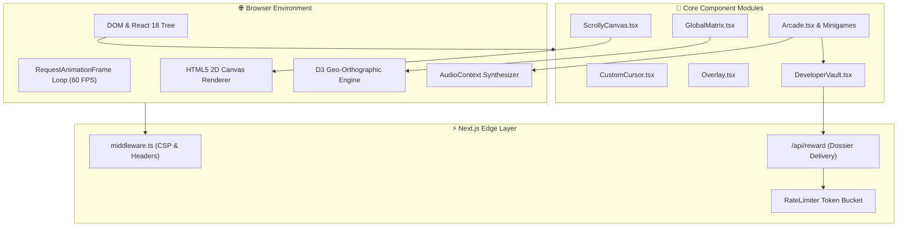

# System Architecture — Portfolio 2.0

This document provides a comprehensive architectural deep-dive into the design, component interactions, rendering lifecycle, and data flow of **Lakshya Agarwal Portfolio 2.0**.

---

## 🏛️ High-Level System Architecture

Portfolio 2.0 is built on **Next.js 14 App Router** and structured around three distinct functional tiers:

1. **Presentation & Scrollytelling Layer (Client Engine)**: High-speed canvas frame streaming, D3 orthographic geospatial projections, Framer Motion coordinate transformations, and tactile spring physics.
2. **Procedural Acoustic Synthesis Layer (Zero-Asset Web Audio)**: On-the-fly oscillator sound design delivering real-time haptic and audio feedback without audio file bundle payloads.
3. **Edge Defense & API Layer (Next.js Edge Runtime)**: Security middleware, Content Security Policy (CSP) headers, sliding-window rate limiting, and honeypot bot defenses.



---

## 📦 Directory & Component Structure

```
portfolio/
├── .github/                      # GitHub Actions CI/CD & Governance
│   ├── ISSUE_TEMPLATE/           # Structured bug & feature templates
│   ├── workflows/                # CI & Release pipelines
│   ├── CODEOWNERS                # Domain ownership definitions
│   ├── dependabot.yml            # Automated dependency updater
│   └── PULL_REQUEST_TEMPLATE.md  # Quality assurance PR checklist
├── docs/                         # In-depth architectural & domain docs
│   ├── ARCHITECTURE.md           # This document
│   ├── PERFORMANCE.md            # 60 FPS rendering & memory optimization
│   ├── ACCESSIBILITY.md          # WCAG 2.2 AA compliance breakdown
│   ├── SECURITY.md               # Threat modeling & security headers
│   ├── API.md                    # Edge endpoint documentation
│   └── repositories/             # Flagship project README specifications
├── public/                       # Static public assets, vector emblems & media
├── src/
│   ├── app/                      # Next.js 14 App Router routes & API endpoints
│   │   ├── api/reward/           # Dossier delivery endpoint
│   │   ├── layout.tsx            # Root layout, metadata & global font config
│   │   ├── page.tsx              # Main scrollytelling entrypoint
│   │   └── not-found.tsx         # Cybernetic 404 recovery state
│   ├── components/               # Core UI & presentation components
│   │   ├── minigames/            # Developer Arcade 2.0 interactive games
│   │   │   ├── PixelFootball.tsx # Trajectory physics football simulation
│   │   │   ├── TechFactory.tsx   # Chip fabrication pipeline mini-game
│   │   │   ├── TerminalHacker.tsx# Memory exploitation cipher puzzle
│   │   │   └── DeveloperVault.tsx# Reward modal & confidential dossier
│   │   ├── ui/                   # Reusable atomic UI elements
│   │   │   ├── FuturisticNavigation.tsx # Accent theming & vector glyphs
│   │   │   └── ProjectCard.tsx   # 3D glare physics project cards
│   │   ├── work/                 # Individual project showcase modal views
│   │   │   ├── RedGambit.tsx     # Adversarial AI Chess Engine modal
│   │   │   ├── Todar.tsx         # Financial Intelligence Terminal modal
│   │   │   └── ElevateHub.tsx    # Student Venture Incubator modal
│   │   ├── CustomCursor.tsx      # Tactile spring cursor with recoil physics
│   │   ├── ScrollyCanvas.tsx     # 300-frame canvas sequence streamer
│   │   ├── GlobalMatrix.tsx      # D3 orthographic interactive globe
│   │   ├── Languages.tsx         # Interactive language arsenal
│   │   ├── Arcade.tsx            # Arcade 2.0 hub & cartridge system
│   │   └── Contact.tsx           # Signature contact footer & copy protocol
│   └── utils/
│       └── arcadeAudio.ts        # Zero-asset procedural Web Audio synthesizer
├── package.json
├── tsconfig.json
└── tailwind.config.ts
```

---

## 🔄 Core Technical Workflows

### 1. Progressive Frame Streamer (`ScrollyCanvas.tsx`)

To render 300 high-resolution frames smoothly across varying scroll speeds without freezing the main thread:
1. **Initial Mount**: Loads a skeleton set of frames (every 10th frame: `0, 10, 20...`) to ensure immediate responsiveness.
2. **Background Streaming**: Enqueues intermediate frames in an asynchronous hydration pool utilizing `window.requestIdleCallback`.
3. **Scroll Interpolation**: Framer Motion transforms scroll position `[0, 1]` into an exact integer frame index `[0, 299]`.
4. **Hardware Acceleration**: Bitmaps are drawn directly onto an off-screen buffer before blitting to the target canvas, avoiding image decoding latency during active drag/scroll.

### 2. Zero-Asset Procedural Audio Pipeline (`arcadeAudio.ts`)

Instead of fetching external audio files over the network:
1. An isolated `AudioContext` is instantiated on first user interaction.
2. Sounds are procedurally synthesized using chained Web Audio nodes:
   - **Tactile Hover**: Sine wave oscillator sweeping `1400Hz → 800Hz` with exponential gain envelope decay over 25ms.
   - **Mechanical Click**: Triangle oscillator sweeping `520Hz → 180Hz` over 60ms.
   - **Cartridge Snap**: Resonant dual-frequency harmonic thud combined with high-frequency metallic transient snap.
   - **Crowd Roar / Laser**: Bandpass-filtered random white noise buffer with sweeping frequency center.

### 3. Dynamic Theming Engine (`FuturisticNavigation.tsx`)

Themes are strongly typed via `AccentColor` (`cyan | emerald | gold | indigo | purple | amber | green | white`) and propagated through CSS custom variables and Tailwind utilities:
- Dynamically assigns glow rings (`shadow-[0_0_20px_var(--glow)]`), linear beam gradients, and text highlights.
- Prevents CSS duplication while maintaining cohesive cyberpunk aesthetics across all sections.
