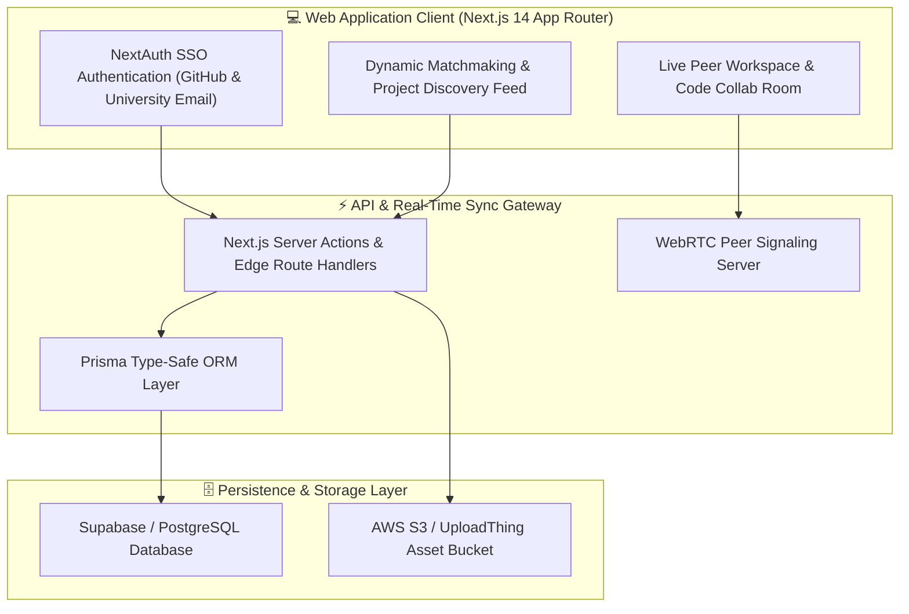

<div align="center">

  # 🌐 ELEVATEHUB // Decentralized Student Collaboration & Venture Incubator

  [](https://elevatehub.lakshya.uk)
  [](https://nextjs.org/)
  [](https://www.typescriptlang.org/)
  [](https://www.postgresql.org/)
  [](https://www.prisma.io/)
  [](https://webrtc.org/)

  <p align="center">
    <b>A collaborative hub empowering student engineers, designers, and founders to form multidisciplinary venture teams, exchange peer code reviews, and showcase technical prototypes.</b>
  </p>

</div>

---

## 🏛️ System Architecture



---

## ✨ Core Features

- **Algorithmic Skill Matchmaking**: Intelligent peer matching algorithm pairing frontend, backend, AI, and design students according to project needs.
- **Real-Time Project Workspaces**: Live markdown design specifications, task sprint boards, and embedded code snippet collaboration.
- **Verified University & Academic Credentials**: Domain-restricted university email verification and GitHub repository activity proofing.
- **Interactive Pitch & Showcase Arena**: Public project demo reels with community upvoting, feedback threads, and mentor reviews.
- **End-to-End Type-Safe Data Layer**: Full relational data modeling with Prisma ORM and automated database migrations.

---

## 🛠️ Tech Stack

- **Frontend**: Next.js 14, React, TypeScript, Tailwind CSS, Radix UI Primitives, Lucide Icons
- **Backend & Database**: Next.js Server Actions, PostgreSQL, Prisma ORM, NextAuth.js
- **Real-Time Communication**: WebRTC, WebSocket Signaling, Socket.io
- **Storage & Media**: AWS S3 / Cloudinary, Vercel Serverless Hosting

---

## 🚀 Installation & Local Development

```bash
# 1. Clone the repository
git clone https://github.com/lak-is-law/elevate-hub.git
cd elevate-hub

# 2. Install dependencies
npm install

# 3. Setup Database environment variables (.env)
cp .env.example .env

# 4. Run Prisma database migrations & generate client
npx prisma migrate dev
npx prisma generate

# 5. Launch local server
npm run dev
```

---

## 🧗 Challenges Faced & Solutions

### 1. Complex Multitenant Permissions & Role Isolation
- **Challenge**: Managing different permission levels (Project Leads, Core Contributors, Mentors, and Viewers) across dozens of collaborative documents without data leaks.
- **Solution**: Designed granular Row-Level Security (RLS) policies and integrated Prisma middleware to enforce role checks before query execution.

### 2. Peer-to-Peer Video/Screen Sync Across NAT Firewalls
- **Challenge**: Students on strict university campus networks faced WebRTC ICE candidate connection failures.
- **Solution**: Configured STUN/TURN server fallback relays with auto-adaptive bitrate renegotiation.

---

## 💡 Lessons Learned

- Next.js Server Actions significantly simplify form handling and optimistic UI updates compared to traditional REST boilerplate.
- Designing a clear database schema with foreign key cascade rules from Day 1 prevents state orphan issues as user bases scale.

---

## 📄 License & Contact

Distributed under the **MIT License**.
Developed by **Lakshya Agarwal** ([contact@lakshya.uk](mailto:contact@lakshya.uk) • [lakshya.uk](https://lakshya.uk)).
