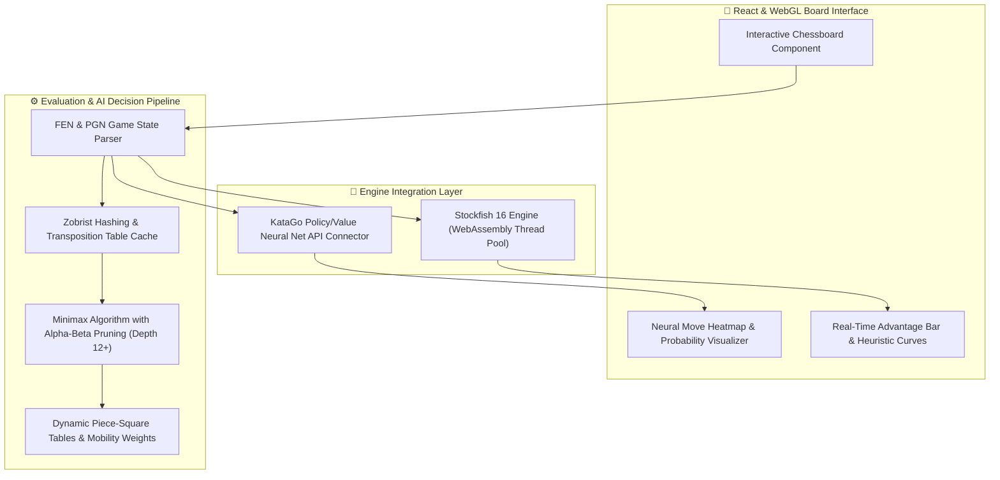

<div align="center">

  # ♟️ RED GAMBIT // AI Adversarial Chess & Game Research Platform

  [](https://redgambit.lakshya.uk)
  [](https://reactjs.org/)
  [](https://www.typescriptlang.org/)
  [](https://stockfishchess.org/)
  [](https://github.com/lightvector/KataGo)

  <p align="center">
    <b>A high-performance adversarial AI research environment featuring multi-engine evaluations, real-time board heuristics, Zobrist transposition caching, and interactive neural move heatmaps.</b>
  </p>

</div>

---

## 🏛️ System Architecture



---

## ✨ Core Features

- **Multi-Engine Evaluation Pipeline**: Dual-engine analysis simultaneously running WebAssembly-compiled Stockfish 16 and KataGo neural value networks.
- **Deep Minimax Engine with Alpha-Beta Pruning**: Custom client-side evaluation engine featuring quiescence search, null-move heuristic, and move ordering optimizations.
- **Transposition Tables via 64-bit Zobrist Hashing**: Drastically eliminates redundant tree search computations across identical positions.
- **Interactive Move Heatmaps**: Visualizes legal move probabilities, tactical blunder alerts, and positional control zones in real time.
- **Dynamic FEN/PGN Serialization**: Instant board state import/export with full game tree branching history.

---

## 🛠️ Tech Stack

- **Frontend**: React 18, TypeScript, Tailwind CSS, Lucide Icons, Framer Motion
- **Engines & AI**: WebAssembly Stockfish 16, Custom Alpha-Beta Minimax Engine, KataGo Neural Network API
- **State & Algorithms**: Zobrist Hashing, Bitboard Representations, Quiescence Search
- **Deployment**: Vercel Edge Network, Web Workers for Non-Blocking CPU Threads

---

## 🚀 Installation & Local Development

```bash
# 1. Clone the repository
git clone https://github.com/lak-is-law/red-gambit.git
cd red-gambit

# 2. Install dependencies
npm install

# 3. Launch local dev server
npm run dev
```

---

## 🧗 Challenges Faced & Solutions

### 1. Main-Thread Stalls During Deep Engine Search
- **Challenge**: Running Minimax computations with depth > 6 on the main UI thread froze DOM animations and user drag events.
- **Solution**: Offloaded all search algorithms and WASM Stockfish instances to dedicated Web Workers (`WorkerPool`), keeping the main thread strictly at 60 FPS.

### 2. High Memory Consumption with Transposition Tables
- **Challenge**: Uncapped transposition table caches during rapid blunder-check analysis consumed excessive RAM on mobile browsers.
- **Solution**: Implemented an LRU eviction policy with a bounded 64MB 64-bit Zobrist hash table.

---

## 💡 Lessons Learned

- Bitboard representations (`BigInt` / `Uint32Array`) offer a 4x throughput improvement over 2D array board representation.
- Multi-threaded Web Workers require structured memory cloning (`SharedArrayBuffer` with COOP/COEP headers) to achieve sub-millisecond evaluation exchange.

---

## 📄 License & Contact

Distributed under the **MIT License**.
Developed by **Lakshya Agarwal** ([contact@lakshya.uk](mailto:contact@lakshya.uk) • [lakshya.uk](https://lakshya.uk)).
