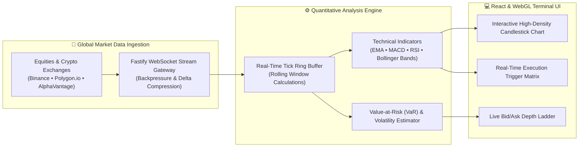

<div align="center">

  # 📈 TODAR 2.0 // Real-Time Algorithmic Financial Intelligence Terminal

  [](https://todar.finance.lakshya.uk)
  [](https://nextjs.org/)
  [](https://www.typescriptlang.org/)
  [](https://developer.mozilla.org/en-US/docs/Web/API/WebSockets_API)
  [](https://d3js.org/)

  <p align="center">
    <b>A high-throughput quantitative market analytics platform delivering sub-50ms tick streaming, multi-asset order book depth, predictive trend models, and automated algorithmic signal alerts.</b>
  </p>

</div>

---

## 🏛️ System Architecture



---

## ✨ Core Features

- **Sub-50ms Market Tick Streaming**: Bi-directional WebSocket stream protocol with message compression and auto-reconnection backoff.
- **High-Density Candlestick & Volume Charts**: Custom canvas/D3-accelerated candlestick renderer capable of displaying 50,000+ data points smoothly.
- **Level 2 Order Book Depth Ladder**: Live visual order book displaying dynamic bid/ask walls, order imbalances, and microsecond volume profiles.
- **Automated Algorithmic Alert Engine**: Configurable mathematical threshold triggers (e.g. RSI divergence, Golden Cross, Bollinger band squeeze).
- **Multi-Asset Portfolio Risk Simulation**: Monte Carlo simulation and historical Value-at-Risk (VaR) calculations across diversified portfolios.

---

## 🛠️ Tech Stack

- **Frontend**: Next.js 14, React, TypeScript, Tailwind CSS, Recharts, D3.js
- **Backend & Stream**: Node.js, Fastify, WebSocket protocol, Redis Pub/Sub
- **Financial Computation**: Math.js, Custom quantitative statistics library
- **Infrastructure**: Vercel Edge Serverless, Upstash Redis, Docker

---

## 🚀 Installation & Local Development

```bash
# 1. Clone repository
git clone https://github.com/lak-is-law/todar-finance.git
cd todar-finance

# 2. Install dependencies
npm install

# 3. Configure .env.local
cp .env.example .env.local

# 4. Start local development server
npm run dev
```

---

## 🧗 Challenges Faced & Solutions

### 1. High-Frequency State Thrashing in React
- **Challenge**: Receiving 200+ WebSocket market ticks per second triggered excessive React re-render cycles, causing frame drops.
- **Solution**: Batched incoming ticks into a high-speed typed ring buffer (`Float64Array`) and flushed state updates to the UI at an optimized 60 FPS using `requestAnimationFrame`.

### 2. Chart Layout Performance on Huge Timeframes
- **Challenge**: Rendering multi-year historical 1-minute candle datasets overloaded SVG DOM nodes.
- **Solution**: Implemented Canvas-based level-of-detail (LOD) downsampling (Largest-Triangle-Three-Buckets algorithm) to render only visible data points on viewport zoom.

---

## 💡 Lessons Learned

- WebSocket payload size directly dictates client rendering performance; switching from verbose JSON to binary protocols (`MessagePack` / `Protocol Buffers`) reduced bandwidth by 65%.
- Pure functional calculation pipelines facilitate bulletproof unit testing for risk modeling algorithms.

---

## 📄 License & Contact

Distributed under the **MIT License**.
Developed by **Lakshya Agarwal** ([contact@lakshya.uk](mailto:contact@lakshya.uk) • [lakshya.uk](https://lakshya.uk)).
